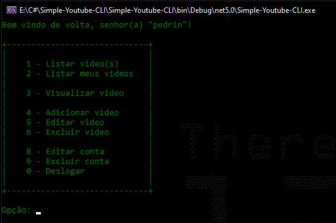
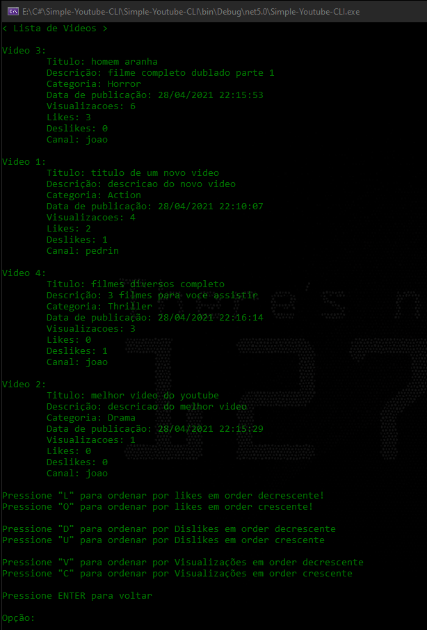
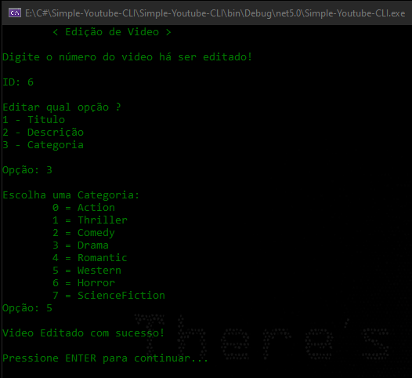
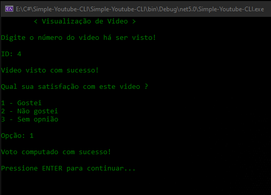
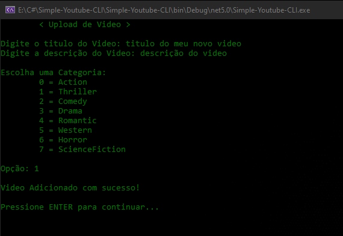
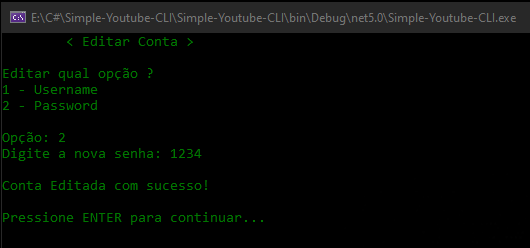
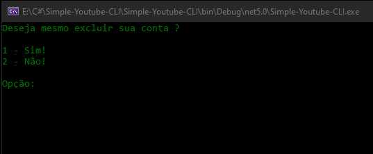
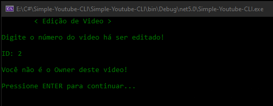
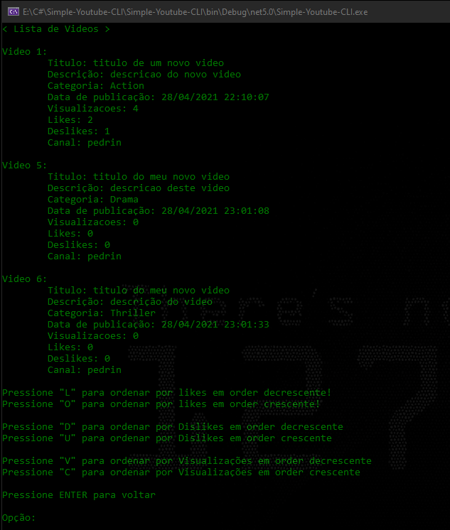
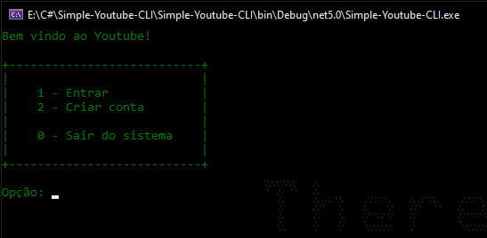

<h1 align="center"> Simple youtube CLI </h1>

[]()

- Also, you can write by opening an Issue and also solve a current issue if possible.
- Fork this project to your Github acoount.
- This software is created under [MIT License](https://github.com/MuriloChianfa/Simple-Youtube-CLI/blob/main/LICENSE)

Installing the Entity Framework
```bash
$ Install-Package Microsoft.EntityFrameworkCore.Sqlite
```

To create database: 
```bash
$ Install-Package Microsoft.EntityFrameworkCore.Tools
$ Add-Migration InitialCreate
$ Update-Database
```

# Some examples:

<br />

## MainMenu
<p align="center">
	- 
</p>

## List all uploaded videos
<p align="center">
	- 
</p>

## Editing one exitent video
<p align="center">
	- 
</p>

## View one video
<p align="center">
	- 
</p>

## Upload a new video
<p align="center">
	- 
</p>

## Editing the profile
<p align="center">
	- 
</p>

## Remove the account
<p align="center">
	- 
</p>

## Not have permission to edit this video
<p align="center">
	- 
</p>

## Listing just my videos
<p align="center">
	- 
</p>

## Login Menu
<p align="center">
	- 
</p>
